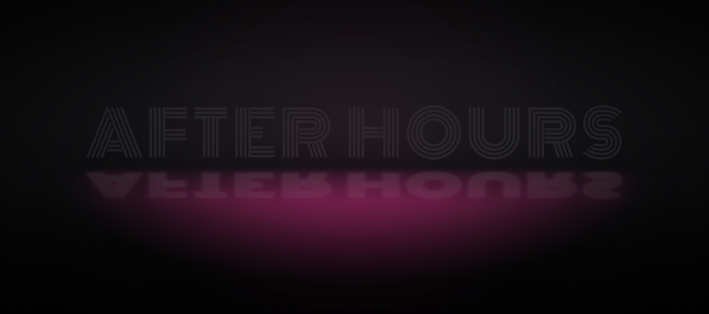

# neon-text

A neon sign that assembles, strikes and burns - built from a particle field.

**[▶ Live playground](https://nirshribman.github.io/neon-text/)** · type any text, six animations,
any Google font, shareable links.



Real DOM text carries the tube. A canvas of particles behind it carries the gas, the assembly and the
flash. Neither layer alone does the job: **dots can't render a continuous saturated tube, and canvas
letters aren't text** - so each layer does what the other can't. The result stays crisp, selectable
and screen-reader-legible while still *arriving* rather than merely switching on.

## Quick start

```html
<link rel="stylesheet" href="src/neon.css">
<div id="stage" style="width:100vw;height:100vh"></div>
<script src="src/neon.js"></script>
<script>
  Neon.create('#stage', { text: 'AFTER HOURS' });
</script>
```

That's the whole integration - a sized container and one call. No build step, no dependencies, no
npm. Open [`examples/minimal.html`](examples/minimal.html) straight from disk and it runs.

## API

```js
const sign = Neon.create('#stage', {
  text:  'OPEN|ALL NIGHT',   // "|" starts a new line
  mode:  'cascade',          // strike · cascade · random · wave · assemble · trace · broken · drain · instant
  font:  'Monoton',          // any Google font, or a system face
  glow:  '#ff2d95',
  tube:  1,                  // 1 = neon tube · 0 = letterform of pure particles
});

sign.set({ mode: 'assemble', dots: 9000 });   // rebuilds only what changed
sign.look('Cyber');                            // a complete preset
sign.replay();                                 // restart the sequence
sign.pause();  sign.step();                    // drive frames by hand
sign.resume();
sign.destroy();

await Neon.loadFont('Bungee');                 // → { ok, weight, caps }
Neon.MODES · Neon.EXIT_MODES · Neon.LOOKS · Neon.DEFAULTS · Neon.SYS_FONTS
```

### Animation modes

| Mode | Behaviour |
|---|---|
| `strike` | flicker, false starts, then one hard flash - every letter at once |
| `cascade` | letters fire one by one, left to right, each with its own flash |
| `random` | same, in scrambled order - a sign wiring itself up |
| `wave` | all lit, with a pulse of light travelling along the tube |
| `assemble` | particles fly in and **build the letterform**, then it ignites |
| `trace` | a hot head of light sweeps the ink left to right, filling the letters behind it |
| `broken` | a tired sign - one or two letters stutter, die, and keep trying |
| `drain` | the **exit**: power cuts, letters die in a ripple, the gas lets go and drifts away |
| `instant` | straight on |

`drain` is the only exit mode (`Neon.EXIT_MODES`) - everything else is an entrance. Under
`prefers-reduced-motion` an exit renders its honest end state: the dead sign, immediately.

### Two options that change what it is

- **`tube` (0-1)** - a continuum from *neon tube with gas around it* (1) to a letterform made of
  **nothing but particles** (0).
- **`hug` (0-1)** - where the unlit gas lives: a room-filling haze (0), or glow clinging to the
  letterforms only (1).

Everything is **per character** - its own dots, DOM spans, colour and strike frame. That's what makes
per-letter flashing possible at all; the modes are just different schedules over the same machinery.

## Notes

**Accessibility.** The sign carries `role="img"` and an `aria-label` with the full string. Under
`prefers-reduced-motion` there's no assembly, no flicker and no flash - the dots start on target so
the first painted frame is the finished, legible sign.

**Flashing.** WCAG 2.3.1 caps flashing at three per second, and the general-flash threshold applies
above ~25% of the viewport. The wide flash fires **once**, only in `strike`; per-letter flashes are
small, local and tightly bloomed. Don't raise `pulses` above 3.

**Performance.** Cost is dominated by `fillRect` count. Measured over real rAF frames: full rate to
~10k dots, 60fps to ~16k. Past that, per-dot `fillRect` is the wrong primitive - use `ImageData`.

**Fonts.** System faces work offline. Google fonts are the only network dependency; self-host the one
face you ship if you need offline. Some signage faces (Bungee, Bebas Neue, Staatliches, Six Caps) are
**uppercase-only** - lowercase codepoints map to capital glyphs. Nothing here transforms your text;
`Neon.loadFont()` reports `caps: true` so you can warn.

**Browsers.** Chrome/Edge/Safari/Firefox, current. Classic script on purpose, not an ES module -
`import` is blocked from `file://`, and being openable straight from disk is half the point.

## Versions

`versions/` holds frozen single-file builds. They never change, so a link to one keeps working
regardless of what happens to `src/`. See [CHANGELOG.md](CHANGELOG.md).

## Credits

The dot-field technique this grew out of started from a 250-character `#つぶやきProcessing` sketch by
[@Hau_kun](https://x.com/Hau_kun/status/1953081097904111701). The neon build, the scene and the
per-character engine are original work on top of it.

Design notes and the review history that shaped it are in [`docs/`](docs/) - including the parts that
were measured and turned out wrong.

MIT © 2026
